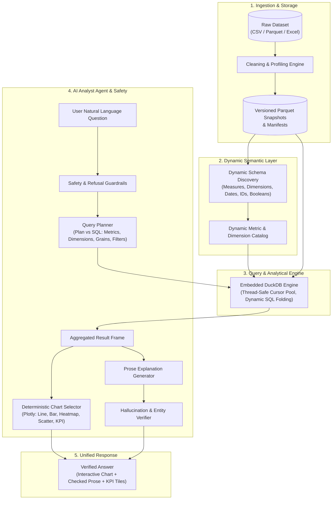
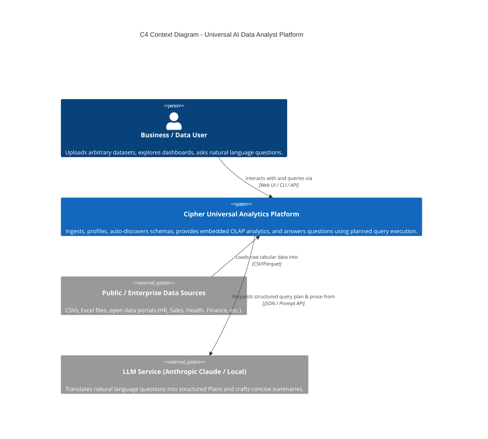
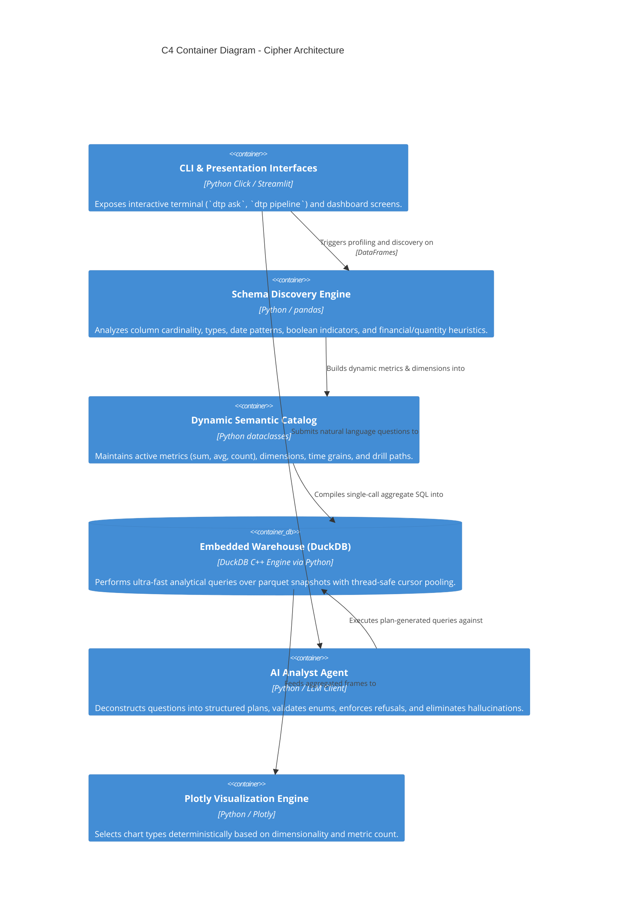
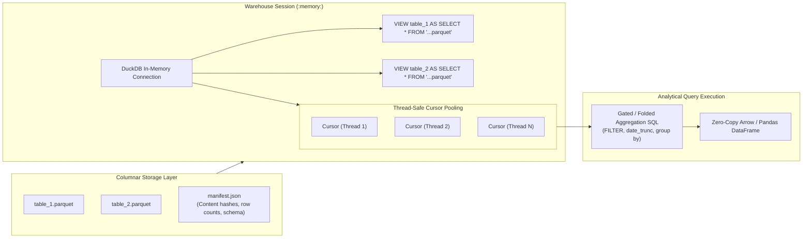
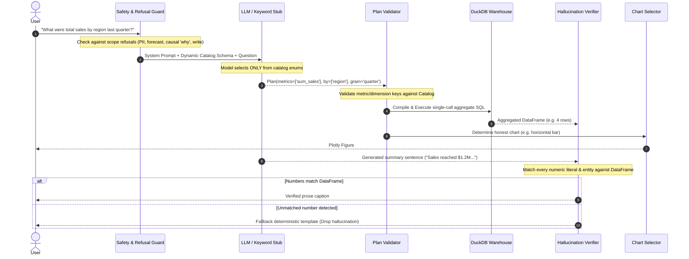
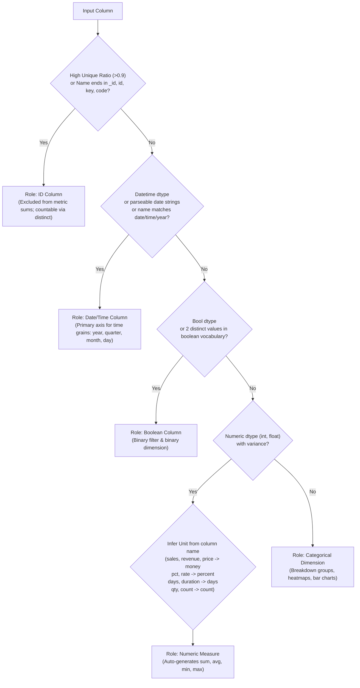

# Cipher Universal AI Data Analyst — System Architecture

This document describes the architectural design of Cipher as a **Universal, Dataset-Agnostic Data-to-Insights Platform**. It covers the system context, component containers, dynamic schema discovery, DuckDB analytical query engine, LLM planning and hallucination guardrail flow, and storage architectures.

---

## 1. High-Level Architecture Overview

Cipher processes arbitrary tabular datasets through five core layers:

---

## 2. C4 Model Context Diagram (System Context)

The C4 Context diagram shows how external actors and data sources interact with the Universal AI Data Analyst platform:

---

## 3. C4 Container Diagram

---

## 4. Database & Analytical Engine Architecture

Cipher uses **DuckDB** as an embedded in-memory OLAP warehouse reading columnar Parquet snapshots:

### Key Architectural Invariants
1. **Read-Only by Construction**: DuckDB connects to `:memory:` and mounts files as views, guaranteeing that no analytical query can corrupt disk files.
2. **Thread Safety**: DuckDB connections are wrapped in `threading.local` cursor dispensers, allowing concurrent user queries without locking errors.
3. **Deterministic Hashing**: Snapshots are fingerprinted using `pd.util.hash_pandas_object` rather than raw parquet byte hashes, making checks immune to compression nondeterminism.

---

## 5. LLM Query Planning & Hallucination Guard Architecture

Cipher avoids the catastrophic failure modes of naive Text-to-SQL by enforcing an **intermediate structured query plan**:

---

## 6. Dynamic Schema Discovery Classification

When an unprofiled dataset is loaded, columns are classified through a deterministic hierarchy:

